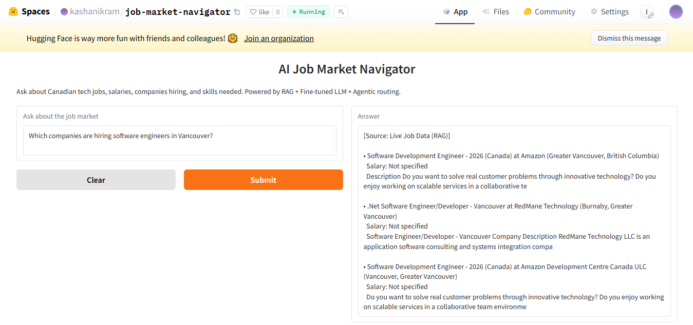

# Job Market Navigator

I built this to answer one question — "what's actually happening in the Canadian tech job market right now?"

It pulls live job postings from the Adzuna API, stores them in a FAISS vector index, and uses a fine-tuned DistilGPT-2 to answer questions about salaries, skills, and which companies are hiring. An agentic router decides whether to fetch live data or rely on the trained model depending on what you ask.

👉 [Try the live demo](https://huggingface.co/spaces/kashanikram/job-market-navigator)

## What it does

Ask it something like:

- "Which companies are hiring ML engineers in Toronto?"
- "What skills do I need for a data science role?"
- "What's the salary range for software engineers in Vancouver?"

It figures out whether your question needs live data or model knowledge — then answers accordingly.

## How it works

User sends a query → Agentic router classifies it → RAG fetches live job data OR fine-tuned model generates an answer → Response returned

- RAG layer — embeds the query, searches FAISS index of 300 real Canadian job postings, returns the most relevant results
- Fine-tuned LLM — DistilGPT-2 trained with LoRA on 853 job postings, handles career advice and skill-based questions
- Agentic router — keyword-based classifier that decides which layer to call based on the query type

## Stack

- DistilGPT-2 + LoRA (PEFT) — fine-tuned on 853 real job postings in instruction-tuning format
- FAISS + sentence-transformers — semantic search over 300 live Canadian job postings
- Adzuna Jobs API — free API used to fetch real-time Canadian job data
- Gradio — frontend UI
- HuggingFace Spaces — deployment platform
- Google Colab (T4 GPU) — used for training and development

## Dataset

Fine-tuned on [jacob-hugging-face/job-descriptions](https://huggingface.co/datasets/jacob-hugging-face/job-descriptions) — 853 real job postings from companies like Google, Amazon, and Bloomberg, formatted as instruction-tuning pairs.

## Project Structure

├── app.py                          Gradio app + agentic router + RAG + model inference
├── requirements.txt                All dependencies
├── Notebook1_Finetune              Fine-tuning DistilGPT-2 with LoRA on job data
├── Notebook2_RAG_Index             Fetching Adzuna API data + building FAISS index
└── Notebook3_Agent_Gradio          Agentic system + Gradio demo

## Model

Fine-tuned model hosted on HuggingFace: [kashanikram/job-market-navigator-distilgpt2](https://huggingface.co/kashanikram/job-market-navigator-distilgpt2)

## Built by

Kashan Ikram — BS Computer Science (AI specialization) @ BIMS, Pakistan
